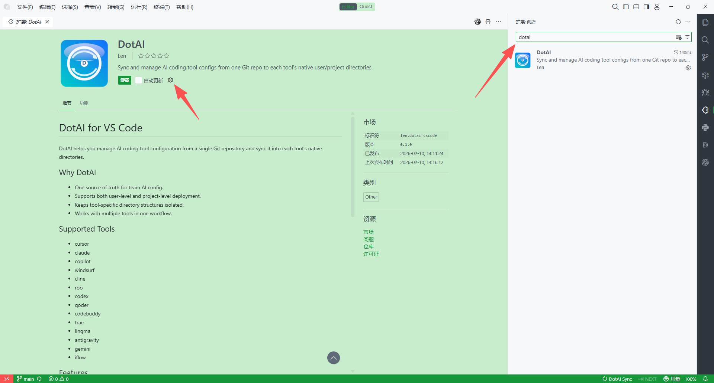
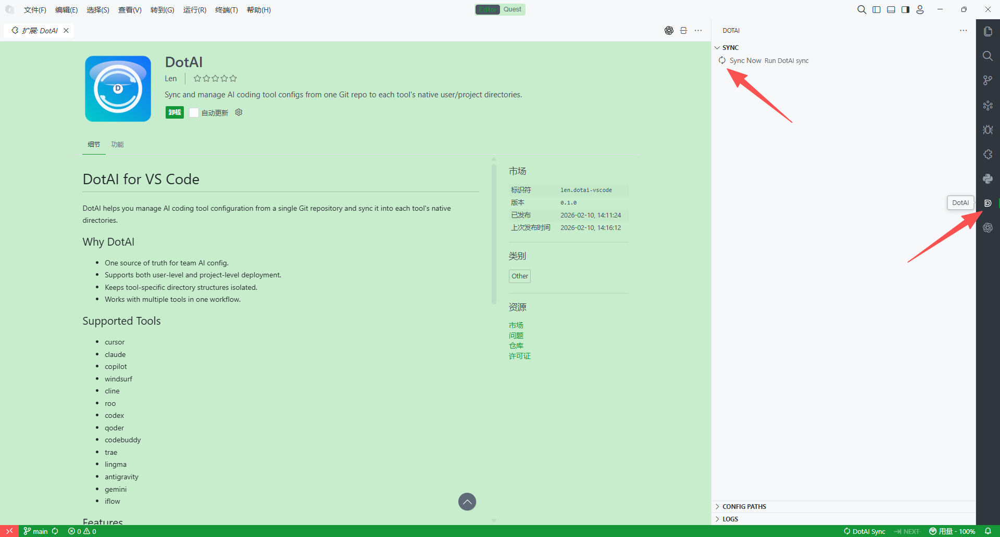
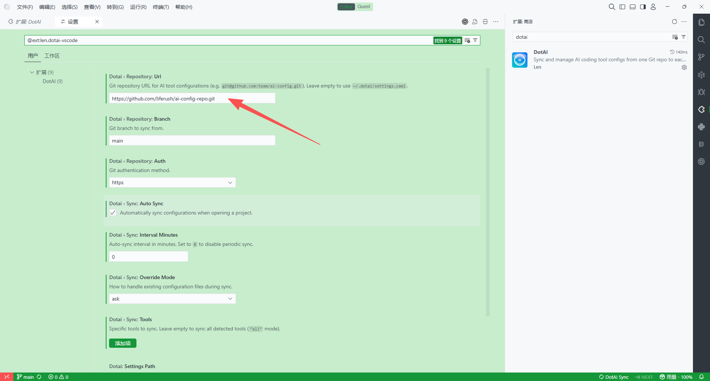
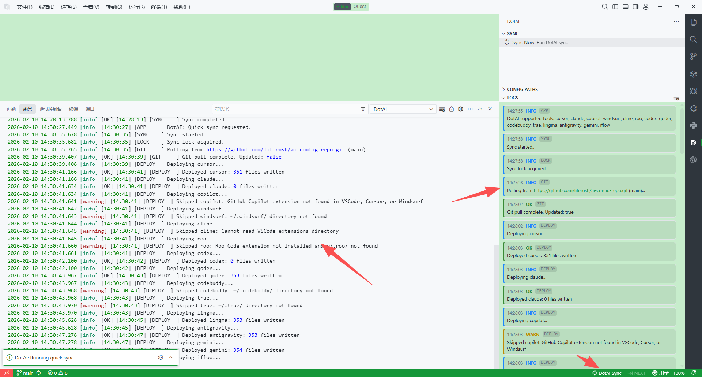
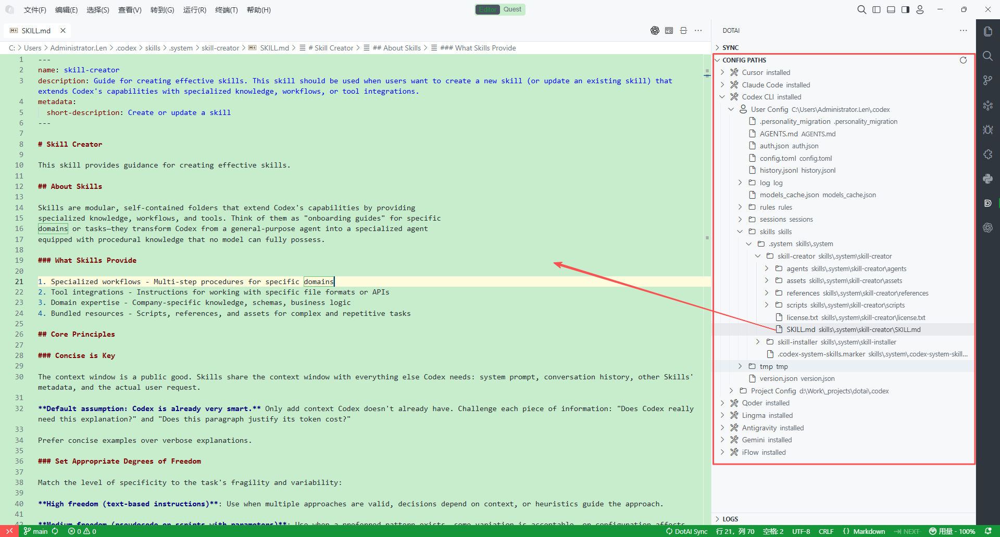
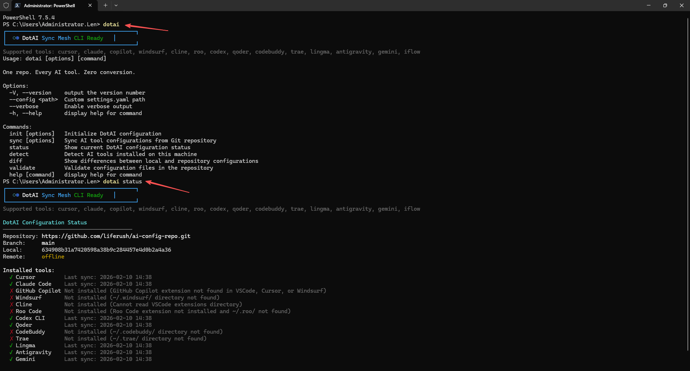
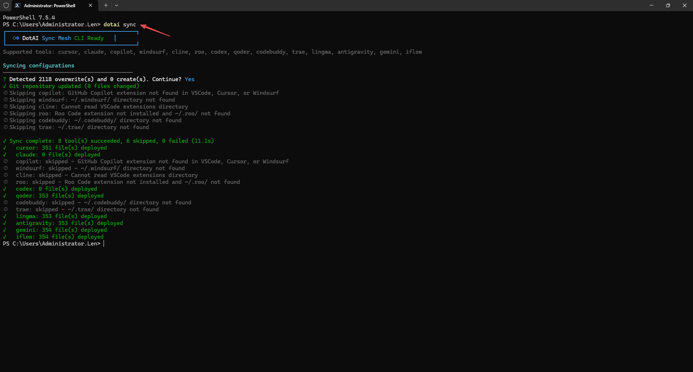
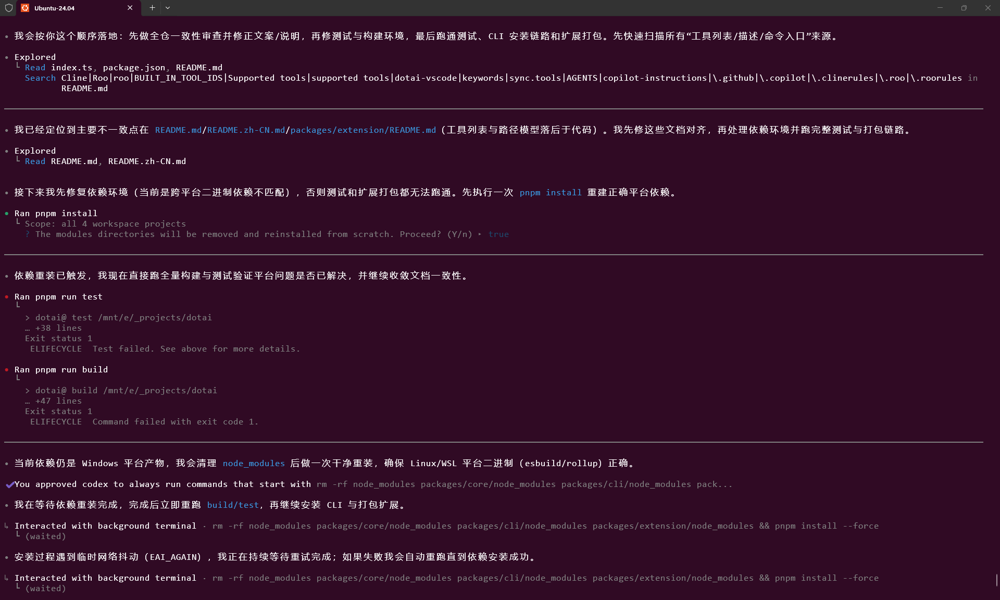

# DotAI：一个仓库，统一管理所有 AI 编程工具配置

DotAI 是一个开源项目，项目仓库地址：`https://github.com/bajinzhi/dotai`。

在 AI 辅助开发进入团队日常后，一个常见问题越来越明显：

- 配置分散在不同工具和路径里，难以统一维护
- 团队规则难以版本化、评审和复用
- 新成员上手成本高，环境一致性难保障
- 个人有多台电脑时，配置同步费时且容易遗漏

DotAI 的目标很直接：把 AI 配置管理做成标准化工程能力。

一句话概括：**一个 Git 仓库，管理所有 AI 工具配置；原生格式，零转换。**

## DotAI 解决了什么问题？

你可能正在同时使用 Cursor、Claude Code、GitHub Copilot、Windsurf、Codex CLI、Qoder 等工具。每个工具都有自己的配置规范和落盘路径，例如：

- `.cursor/rules/`
- `CLAUDE.md`
- `.github/copilot-instructions.md`
- `.windsurf/rules/`

这些配置文件一旦分散，团队和个人都会面临：

- 规则更新无法同步
- 本地环境与 CI/团队环境不一致
- 多设备（公司电脑/家里电脑）之间难以保持配置一致
- 配置变更缺少审计和回滚能力

DotAI 将这些问题统一收敛到 Git 工作流中：**集中存储、自动分发、可追踪、可回滚。**

## DotAI 的核心价值

### 1. 原生格式，零转换
不引入中间 DSL，不做格式重写。你在仓库提交什么，工具最终读取的就是什么。

### 2. Git 驱动的唯一真实源（SSOT）
所有 AI 配置集中在一个 Git 仓库中，天然继承版本历史、Code Review、分支治理能力。

### 3. CLI + VSCode 插件双入口
- CLI 适合自动化、脚本化、批量管理
- VSCode 插件适合图形化操作与状态查看
- 两者共享同一份 `~/.dotai/settings.yaml`

### 4. 用户级 + 项目级双作用域
既能管全局（`~/`），也能管项目（当前工作区），并且可独立同步。

### 5. 可扩展适配器架构
新增工具支持只需实现一个 `ToolAdapter` 接口，无需改核心逻辑。

## 已支持的主流工具

DotAI 已支持并持续扩展以下生态：

- Cursor
- Claude Code
- GitHub Copilot
- Windsurf
- Cline
- Roo Code
- Codex CLI
- Qoder
- CodeBuddy
- Trae
- Lingma
- Antigravity
- Gemini
- iFlow

## 三步快速上手

```bash
dotai init --repo git@github.com:team/ai-config.git
dotai sync
dotai status
```

- `init`：绑定配置仓库，初始化本地设置
- `sync`：将仓库配置分发到各 AI 工具原生路径
- `status`：检查同步状态，确认当前环境一致性

常用增强参数：

```bash
dotai sync --tool cursor,claude   # 仅同步指定工具
dotai sync --dry-run              # 仅预览，不写入
dotai sync --force                # 强制覆盖
```

## 操作截图（发布时补图）

### 1. 在扩展市场安装 DotAI


### 2. 打开 DotAI 侧边栏并进入同步面板


### 3. 配置仓库地址与同步参数


### 4. 查看同步日志与执行结果


### 5. 查看配置路径映射


### 6. 使用 CLI 查看状态


### 7. 使用 CLI 执行同步


### 8. 可选：Linux/WSL 构建测试流程


## 适合哪些团队使用？

- 同时使用多个 AI 工具的研发团队
- 希望沉淀团队提示词/规则资产的组织
- 对工程一致性、可审计性有要求的项目
- 希望降低新人环境配置成本的技术团队

## 为什么现在就可以开始？

DotAI 本质上把“AI 配置”纳入了你已经熟悉的 DevOps 体系：

- 用 Git 做统一配置中枢
- 用标准命令做分发和校验
- 用可扩展架构持续接入新工具

这不是一次性的脚本，而是一套可长期演进的配置治理方案。

## 开源与地址

- 开源仓库：`https://github.com/bajinzhi/dotai`
- 欢迎 Star、Issue、PR，一起完善多 AI 工具配置管理生态

## 结语

如果你的团队正在被“多 AI 工具配置碎片化”困扰，DotAI 可以成为那条统一主线：

**把分散的配置，收敛为可管理、可协作、可演进的工程资产。**

你只需要维护一份仓库，其余交给 DotAI。
